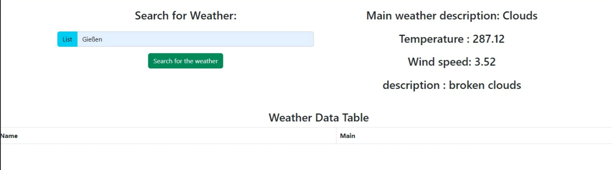
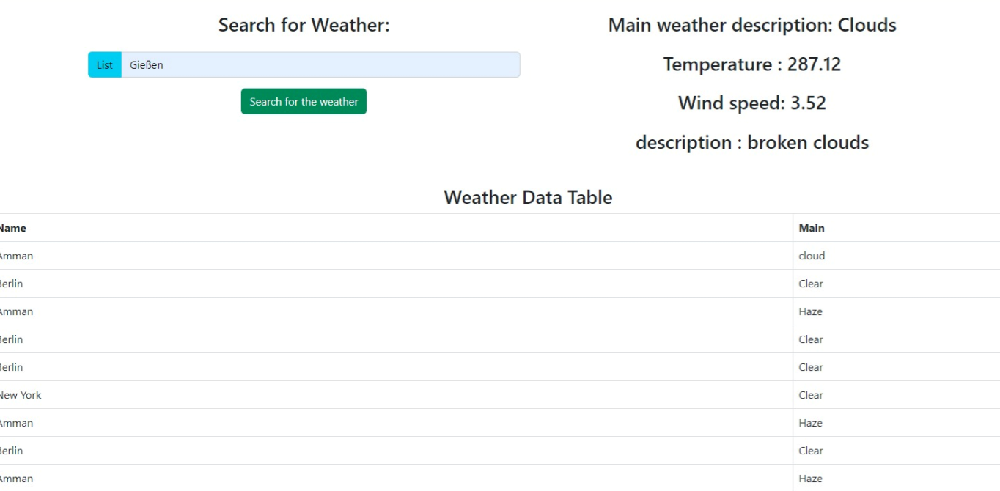

# Cloud-Native Microservice für eine WetterApp.

## Gruppen Mitglieder
- Yaman Albakri
- Amine Jib


## Erforderliche Repository zum Herunterladen, um die gesamte Anwendung auszuführen


- [ ] [Backend Gateway Service](https://git.thm.de/amine/backend-gateway-service)
- [ ] [Backend Weather Service](https://git.thm.de/amine/backend-service-collector)
- [ ] [Backend Details Service](https://git.thm.de/amine/service-details)
- [ ]  Für das Frontend können Sie die Zip-Datei herunterLaden

***


# Beschreibung
Unsere Wetter-App ist eine benutzerfreundliche Anwendung,
die den Benutzern detaillierte Wetterinformationen für jede Stadt liefert.
Mit der App können Benutzer das aktuelle Wetter,
Vorhersagen für die nächsten Tage, Temperatur, Luftfeuchtigkeit, Windgeschwindigkeit
und andere relevante Informationen für ihre ausgewählten Standorte abrufen.
***
## Visuelle Darstellung



***

# Backend
Der Gateway-API verarbeitet eingehende Anfragen von Ihrem Frontend und leitet sie an die entsprechenden Microservices weiter.
Die Gateway-Komponente verwendet den ClientProxy von NestJS, um mit den Microservices zu kommunizieren.
Die Methode getWeather und getList verwenden den entsprechenden ClientProxy, um Anfragen an die Microservices zu senden.
***


# Frontend
Unsere Anwendung verwendet Angular im Frontend,
um eine leistungsstarke Benutzeroberfläche zu schaffen.
Mit Angular können wir interaktive Features implementieren und eine ansprechende Benutzererfahrung bieten.
Das Framework ermöglicht uns
eine strukturierte Codebasis
und vereinfacht die Entwicklung von komplexen Benutzeroberflächen.
***

# Architecture
Unser Projekt basiert auf einer Microservices-Architektur,
bei der alle Komponenten unabhängig voneinander agieren und kommunizieren.
Jeder Microservice übernimmt eine spezifische Funktionalität und kann eigenständig entwickelt,
bereitgestellt und skaliert werden. Die Kommunikation zwischen den Microservices erfolgt über APIs,
die einen reibungslosen Datenaustausch und Interaktionen ermöglichen.
***

# Interaktion und Kommunikation der Komponente mit Clients und Services
Unsere Komponente nutzt eine API-basierte Kommunikation zwischen den verschiedenen Services.
Hierbei werden APIs (Application Programming Interfaces) verwendet,
um die Interaktion und den Austausch von Daten zwischen den einzelnen Services zu ermöglichen.
Durch die klare Definition und Bereitstellung von APIs können die Services effizient und sicher miteinander kommunizieren.

Um eine einheitliche Schnittstelle für die Clients bereitzustellen und den Zugriff auf die Services zu verwalten,
verwenden wir ein Gateway.
Das Gateway fungiert als zentraler Einstiegspunkt für den Client und leitet die Anfragen an die entsprechenden Services weiter.


Durch die Verwendung von APIs und einem Gateway wird eine lose Kopplung zwischen den Komponenten erreicht.
Jeder Service kann unabhängig entwickelt, bereitgestellt und skaliert werden,
da die Kommunikation über die definierten Schnittstellen erfolgt.
***
# Strategien für eine schnelle Produktionsbereitschaft

Um eine schnelle Produktionsbereitschaft zu erreichen,
können verschiedene Strategien angewendet werden.
Hier sind einige mögliche Ansätze:

**Microservices-Architektur:** Durch den Einsatz einer auf Microservices basierenden Architektur können einzelne Komponenten unabhängig entwickelt und bereitgestellt werden,
was die Produktionsbereitschaft beschleunigt.

***

<p align="center">
  <a href="http://nestjs.com/" target="blank"></a>
</p>

[circleci-image]: https://img.shields.io/circleci/build/github/nestjs/nest/master?token=abc123def456
[circleci-url]: https://circleci.com/gh/nestjs/nest

  <p align="center">A progressive <a href="http://nodejs.org" target="_blank">Node.js</a> framework for building efficient and scalable server-side applications.</p>
    <p align="center">
<a href="https://www.npmjs.com/~nestjscore" target="_blank"></a>
<a href="https://www.npmjs.com/~nestjscore" target="_blank"></a>
<a href="https://www.npmjs.com/~nestjscore" target="_blank"></a>
<a href="https://circleci.com/gh/nestjs/nest" target="_blank"></a>
<a href="https://coveralls.io/github/nestjs/nest?branch=master" target="_blank"></a>
<a href="https://discord.gg/G7Qnnhy" target="_blank"></a>
<a href="https://opencollective.com/nest#backer" target="_blank"></a>
<a href="https://opencollective.com/nest#sponsor" target="_blank"></a>
  <a href="https://paypal.me/kamilmysliwiec" target="_blank"></a>
    <a href="https://opencollective.com/nest#sponsor"  target="_blank"></a>
  <a href="https://twitter.com/nestframework" target="_blank"></a>
</p>
  <!--[](https://opencollective.com/nest#backer)
  [](https://opencollective.com/nest#sponsor)-->

## Description

[Nest](https://github.com/nestjs/nest) framework TypeScript starter repository.

## Installation

```bash
$ npm install
```

## Running the app

```bash
# development
$ npm run start

# watch mode
$ npm run start:dev

# production mode
$ npm run start:prod
```

## Test

```bash
# unit tests
$ npm run test

# e2e tests
$ npm run test:e2e

# test coverage
$ npm run test:cov
```

## Support

Nest is an MIT-licensed open source project. It can grow thanks to the sponsors and support by the amazing backers. If you'd like to join them, please [read more here](https://docs.nestjs.com/support).

## Stay in touch

- Author - [Kamil Myśliwiec](https://kamilmysliwiec.com)
- Website - [https://nestjs.com](https://nestjs.com/)
- Twitter - [@nestframework](https://twitter.com/nestframework)

## License

Nest is [MIT licensed](LICENSE).
